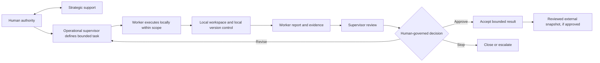

# Two-loop architecture

The pattern connects an operational execution loop to a strategic governance loop. Work is performed in a bounded local context first; only reviewed and approved states move outward to an external repository, archive, or publication channel.

## Strategic loop

The strategic loop clarifies purpose, architecture, risk, publication scope, and unresolved decisions. It supports human judgment but does not replace it.

## Operational loop

1. Receive a bounded task card.
2. Verify scope, access, constraints, and stop conditions.
3. Perform only the allowed local work.
4. Preserve traceability through local records where applicable.
5. Produce a structured report and hand control back.

The worker does not expand the objective or continue into publication, release, deployment, merge, or other consequential action unless those actions are explicitly authorized and within the task boundary.

## Governance review

1. Compare the report and evidence with the task card.
2. Check safety, privacy, licensing, accuracy, public/private boundary, and other applicable gates.
3. Record an outcome: approve, revise, or stop.
4. If revision is allowed, issue a new or updated bounded task.
5. If external publication or repository update is requested, treat it as a separate approval point.

## Key invariant

The operational loop may propose continuation, but only the governance loop may permit it. A report always returns control to the supervisor or human authority.

The architecture describes decision flow at a public, conceptual level. It intentionally omits private prompts, scoring rules, automation triggers, internal paths, and deployment mechanics.
