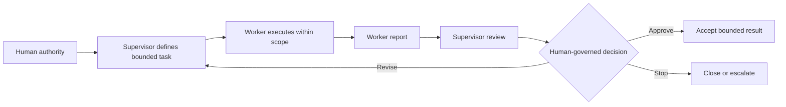

# Two-loop architecture

The pattern connects an inner execution loop to an outer governance loop.

## Inner loop: bounded execution

1. Receive a task card.
2. Verify scope, access, constraints, and stop conditions.
3. Perform only the allowed work.
4. Produce a structured report and hand control back.

The worker does not expand the objective or continue into publication, release, deployment, or other consequential action unless those actions are explicitly authorized and within the task boundary.

## Outer loop: governance

1. Compare the report and evidence with the task card.
2. Check safety, privacy, licensing, accuracy, and other applicable gates.
3. Record an outcome: approve, revise, or stop.
4. If revision is allowed, issue a new or updated bounded task.

## Key invariant

The inner loop may propose continuation, but only the outer loop may permit it. A report always returns control to the governance loop.

The architecture describes decision flow at a public, conceptual level. It intentionally omits private prompts, scoring rules, automation triggers, and deployment mechanics.
